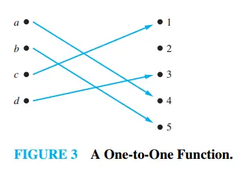

### One-to-One (Injective) Functions

> **Definition: One-to-One Function**
> A function f is said to be one-to-one (or injective) if and only if f(a) = f(b) implies that a = b for all a and b in the domain of f.
>
> **In simple terms:**
> Each element in the codomain is mapped to by at most one element in the domain.

