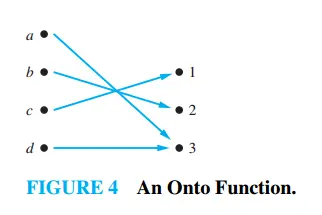

### Onto (Surjective) Functions

> **Definition: Onto Function**
> A function f from A to B is called onto (or surjective) if and only if for every element b ∈ B there is an element a ∈ A with f(a) = b.
>
> **In simple terms:**
> Every element in the codomain is mapped to by at least one element from the domain.

